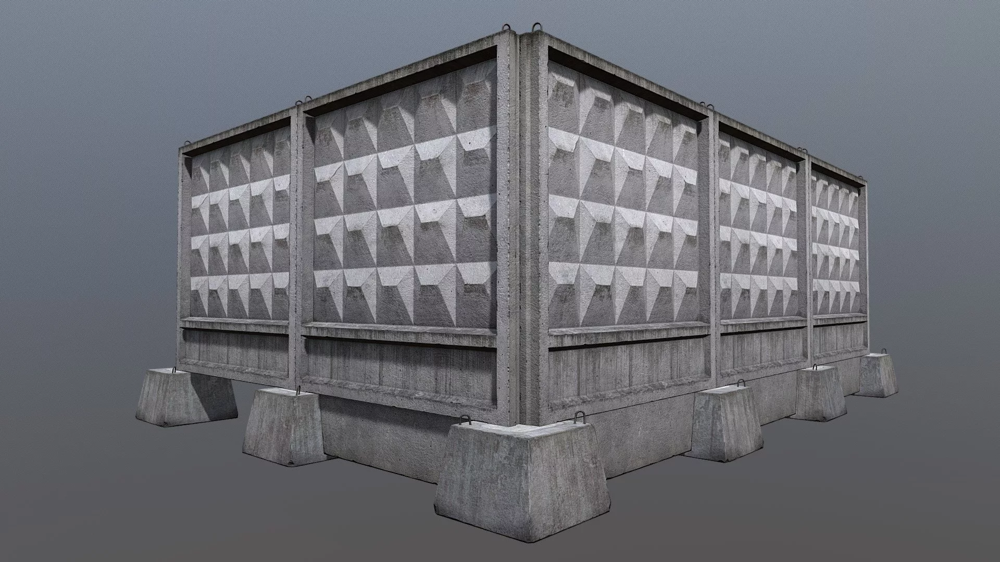

# Plita the Engine

```shell
git clone --recurse-submodules git@github.com:BlackenedBettencourt/plita.git
```

```shell
# in the root dir of source
mkdir build
cd build
cmake ..
cmake --build .
./plita
```
